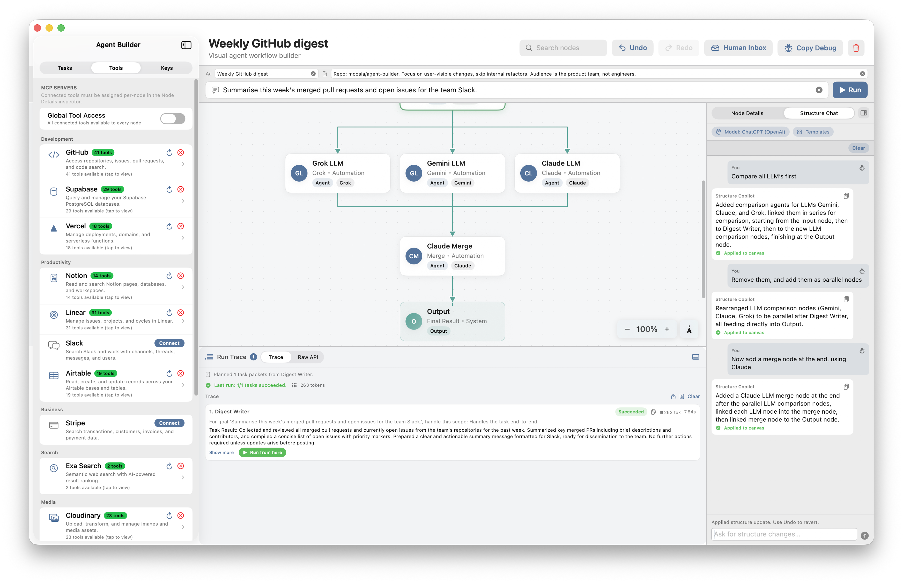

# Agentic

A SwiftUI agent-workflow canvas for designing, running, and inspecting multi-agent pipelines across ChatGPT, Claude, Gemini, and Grok — with a node-graph editor, live execution traces, and MCP tool support.

## Screenshots



## Overview

Agentic lets you:

- author agent workflows as a node graph (input → agents/humans → output)
- run the graph end-to-end against a live LLM provider, or simulate it offline
- step through execution with per-node traces, token counts, and run-from-here
- attach MCP tool servers and assign tools per agent node
- chat with a structure assistant that can mutate the graph for you

## Features

- **Node-graph editor** — drag, link, zoom, search, undo/redo, orphan detection, cycle prevention
- **Built-in and user templates** — coordinator, planner, reviewer, custom node templates saved in SwiftData
- **Live coordinator orchestration** — reachable-node execution, pause on human nodes, approve/reject gates
- **Run-from-here** — re-execute any completed node without rerunning the full pipeline
- **Per-provider API keys** stored in the system Keychain
- **Per-provider model selection** with cached model lists
- **Structure chat** — natural-language graph edits with a dedicated assistant inspector tab
- **MCP integration** — add MCP server connections and surface their tools to agents
- **Mac Catalyst support** — hover tooltips and larger viewport affordances
- **Persistent graph documents** — SwiftData-backed, auto-save on semantic mutation

## Provider Support

| Provider | Chat | Model List | Tool Calling |
|---|---|---|---|
| ChatGPT | Yes | Yes | Yes |
| Claude | Yes | Yes | Yes |
| Gemini | Yes | Yes | Partial |
| Grok | Yes | Yes | Partial |

Notes:

- Live execution requires a valid API key plus a selected model per participating agent node.

## Requirements

- Xcode 17+
- iOS 18 / Mac Catalyst SDK supported by your local Xcode install
- Valid API key(s) for any provider you want to use

The current project settings in `Agentic.xcodeproj` target the latest SDK versions configured in the project file.

## Getting Started

1. Clone this repository.
2. Open [Agentic.xcodeproj](Agentic.xcodeproj) in Xcode.
3. Select the `Agentic` scheme.
4. Choose a run destination (an iPhone simulator or `My Mac (Mac Catalyst)`).
5. Build and run.

CLI build example:

```bash
xcodebuild -project Agentic.xcodeproj -scheme Agentic -configuration Debug build
```

## Usage

1. Launch the app and open the default workflow, or create a new task from the sidebar.
2. Tap an empty canvas area and add agent or human nodes from the **+** menu; link them by dragging from a selected node's link handle.
3. Open the Inspector panel to edit a node's provider, model, role description, tools, and I/O schemas.
4. Paste provider API keys in **Settings** (Keychain-backed) and pick a model per agent node.
5. Press **Run** to execute the live coordinator.
6. Use the Results drawer to step through the trace, view per-node prompts/responses, and run from any completed node.
7. Open the Structure chat tab to ask the assistant to add, remove, or rewire nodes in natural language.

## Data Storage

- API keys are stored securely in the system Keychain.
- Graph documents, user node templates, and MCP server connections are persisted locally with SwiftData.
- Provider/model preferences are stored with `@AppStorage`.
- No server-side app backend is included in this project.

## Testing

Unit tests cover the pure `CanvasLayoutEngine` (cycle detection, reachability, link normalization, default schemas) and the `CanvasViewportState` zoom-clamping helper.

```bash
xcodebuild -project Agentic.xcodeproj -scheme Agentic \
  -destination 'platform=iOS Simulator,name=iPhone 17' \
  -configuration Debug test
```

## Project Structure

**Entry point**
- [Agentic/AgenticApp.swift](Agentic/AgenticApp.swift): App entry point, `ModelContainer` setup, view-model wiring
- [Agentic/ContentView.swift](Agentic/ContentView.swift): Root layout — header, task list, canvas, inspector, results drawer

**App-wide configuration**
- [Agentic/App/AppTheme.swift](Agentic/App/AppTheme.swift): Color tokens (brand, surfaces, link tones)
- [Agentic/App/AppConfiguration.swift](Agentic/App/AppConfiguration.swift): Layout, motion, and canvas constants
- [Agentic/App/AppDependencies.swift](Agentic/App/AppDependencies.swift): Bundled services injected into view models

**Models (domain)**
- [Agentic/Models/Domain/GraphModels.swift](Agentic/Models/Domain/GraphModels.swift): `OrgNode`, `NodeLink`, `LinkTone`, `HierarchySnapshot`
- [Agentic/Models/Domain/ExecutionAndTemplateModels.swift](Agentic/Models/Domain/ExecutionAndTemplateModels.swift): Coordinator run, trace step, built-in templates
- [Agentic/Models/Domain/MCPToolModels.swift](Agentic/Models/Domain/MCPToolModels.swift): MCP tool definitions
- [Agentic/Models/Domain/StructureChatModels.swift](Agentic/Models/Domain/StructureChatModels.swift): Structure assistant request/response parsing
- [Agentic/Models/Domain/TemplateCatalogModels.swift](Agentic/Models/Domain/TemplateCatalogModels.swift): Default schemas, provider enum, preset roles

**Models (persistence)**
- [Agentic/Models/Persistence/GraphDocument.swift](Agentic/Models/Persistence/GraphDocument.swift): SwiftData `@Model` for persisted graphs
- [Agentic/Models/Persistence/UserNodeTemplate.swift](Agentic/Models/Persistence/UserNodeTemplate.swift): User-saved node presets
- [Agentic/Models/Persistence/MCPServerConnection.swift](Agentic/Models/Persistence/MCPServerConnection.swift): MCP server records

**Services**
- [Agentic/Services/Canvas/CanvasLayoutEngine.swift](Agentic/Services/Canvas/CanvasLayoutEngine.swift): Pure layout/graph math (Foundation + CoreGraphics only, fully unit-tested)
- [Agentic/Services/Execution/CoordinatorOrchestrator.swift](Agentic/Services/Execution/CoordinatorOrchestrator.swift): Live coordinator execution
- [Agentic/Services/Execution/LLMWorkflowServices.swift](Agentic/Services/Execution/LLMWorkflowServices.swift): Structure generation and node execution
- [Agentic/Services/MCP](Agentic/Services/MCP): MCP client and tool discovery
- [Agentic/Services/Persistence](Agentic/Services/Persistence): Keychain, model preferences, document wiring
- [Agentic/Services/Providers](Agentic/Services/Providers): Per-provider API adapters

**View models**
- [Agentic/ViewModels/CanvasViewModel.swift](Agentic/ViewModels/CanvasViewModel.swift): Graph state, mutations, persistence coordination
- [Agentic/ViewModels/CanvasViewportState.swift](Agentic/ViewModels/CanvasViewportState.swift): Transient viewport (zoom, search, scroll proxy)
- [Agentic/ViewModels/ExecutionViewModel.swift](Agentic/ViewModels/ExecutionViewModel.swift): Run lifecycle, trace state, run-from-here
- [Agentic/ViewModels/StructureViewModel.swift](Agentic/ViewModels/StructureViewModel.swift): Structure-chat assistant
- [Agentic/ViewModels/NavigationCoordinator.swift](Agentic/ViewModels/NavigationCoordinator.swift): Sheet and modal routing

**Views**
- [Agentic/Views/HeaderBarView.swift](Agentic/Views/HeaderBarView.swift): Top bar — task title, run controls, settings
- [Agentic/Views/Canvas](Agentic/Views/Canvas): Chart canvas, zoom controls, schema controls, orchestration strip
- [Agentic/Views/Inspector](Agentic/Views/Inspector): Node detail + structure chat inspector
- [Agentic/Views/Results](Agentic/Views/Results): Execution trace drawer
- [Agentic/Views/TaskList](Agentic/Views/TaskList): Task list sidebar and row
- [Agentic/Views/Shared](Agentic/Views/Shared): Shared view helpers, model-to-color mappings

**Tests**
- [AgenticTests/CanvasLayoutEngineTests.swift](AgenticTests/CanvasLayoutEngineTests.swift): Cycle detection, reachability, link normalization, schemas
- [AgenticTests/CanvasViewportStateTests.swift](AgenticTests/CanvasViewportStateTests.swift): Zoom clamping and defaults

## Known Limitations

- UI streaming of assistant responses is not yet wired end-to-end for every provider.
- Attachment uploads to agent nodes are not yet supported; nodes exchange structured text payloads.
- MCP tool calling is wired for ChatGPT and Claude; Gemini and Grok tool calling is partial.

## Contributing

See [CONTRIBUTING.md](CONTRIBUTING.md) for how to report bugs, suggest features, and submit pull requests.

## License

[MIT](LICENSE)
